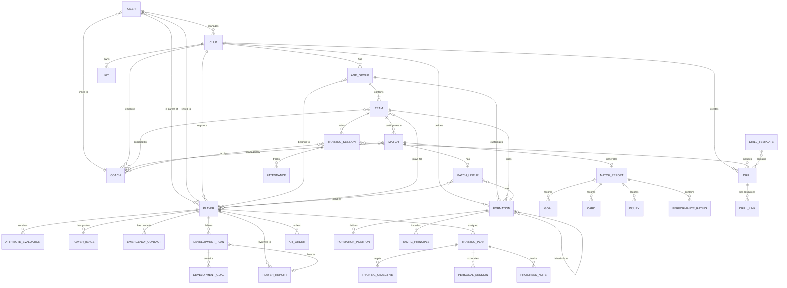

# Database ERD Diagrams

This document contains the Entity Relationship Diagrams for the Our Game football club management system, designed for PostgreSQL.

## Logical ERD (Conceptual Model)



## Physical ERD (PostgreSQL Database Schema)

```mermaid
erDiagram
    users {
        uuid id PK
        varchar(255) email UK
        varchar(100) first_name
        varchar(100) last_name
        user_role_enum role
        uuid club_id FK
        uuid player_id FK
        uuid staff_id FK
        text photo
        jsonb preferences
        timestamp created_at
        timestamp updated_at
    }
    
    clubs {
        uuid id PK
        varchar(255) name
        varchar(50) short_name
        text logo
        varchar(7) primary_color
        varchar(7) secondary_color
        varchar(7) accent_color
        varchar(100) city
        varchar(100) country
        varchar(255) venue
        text address
        int founded_year
        text history
        text ethos
        text[] principles
        timestamp created_at
        timestamp updated_at
    }
    
    kits {
        uuid id PK
        uuid club_id FK
        uuid team_id FK
        varchar(100) name
        kit_type_enum type
        varchar(7) shirt_color
        varchar(7) shorts_color
        varchar(7) socks_color
        varchar(20) season
        boolean is_active
        timestamp created_at
    }
    
    age_groups {
        uuid id PK
        uuid club_id FK
        varchar(100) name
        varchar(50) code UK
        level_enum level
        varchar(20) current_season
        text[] seasons
        varchar(20) default_season
        squad_size_enum default_squad_size
        text description
        boolean is_archived
        timestamp created_at
        timestamp updated_at
    }
    
    age_group_coordinators {
        uuid id PK
        uuid age_group_id FK
        uuid coach_id FK
    }
    
    teams {
        uuid id PK
        uuid club_id FK
        uuid age_group_id FK
        varchar(100) name
        varchar(20) short_name
        level_enum level
        varchar(20) season
        uuid formation_id FK
        varchar(7) primary_color
        varchar(7) secondary_color
        boolean is_archived
        timestamp created_at
        timestamp updated_at
    }
    
    coaches {
        uuid id PK
        uuid club_id FK
        varchar(100) first_name
        varchar(100) last_name
        date date_of_birth
        text photo
        varchar(255) email UK
        varchar(50) phone
        varchar(50) association_id
        boolean has_account
        coach_role_enum role
        text biography
        text[] specializations
        boolean is_archived
        timestamp created_at
        timestamp updated_at
    }
    
    team_coaches {
        uuid id PK
        uuid team_id FK
        uuid coach_id FK
        timestamp assigned_at
    }
    
    players {
        uuid id PK
        uuid club_id FK
        varchar(100) first_name
        varchar(100) last_name
        varchar(50) nickname
        date date_of_birth
        text photo
        varchar(50) association_id
        player_position_enum[] preferred_positions
        int overall_rating
        text[] allergies
        text[] medical_conditions
        boolean is_archived
        timestamp created_at
        timestamp updated_at
    }
    
    player_attributes {
        uuid id PK
        uuid player_id FK
        int ball_control
        int crossing
        int weak_foot
        int dribbling
        int finishing
        int free_kick
        int heading
        int long_passing
        int long_shot
        int penalties
        int short_passing
        int shot_power
        int sliding_tackle
        int standing_tackle
        int volleys
        int acceleration
        int agility
        int balance
        int jumping
        int pace
        int reactions
        int sprint_speed
        int stamina
        int strength
        int aggression
        int attacking_position
        int awareness
        int communication
        int composure
        int defensive_positioning
        int interceptions
        int marking
        int positivity
        int positioning
        int vision
        timestamp updated_at
    }
    
    player_age_groups {
        uuid id PK
        uuid player_id FK
        uuid age_group_id FK
    }
    
    player_teams {
        uuid id PK
        uuid player_id FK
        uuid team_id FK
        timestamp assigned_at
    }
    
    player_parents {
        uuid id PK
        uuid player_id FK
        uuid parent_user_id FK
    }
    
    player_images {
        uuid id PK
        uuid player_id FK
        text url
        varchar(255) caption
        timestamp photo_date
        uuid uploaded_by FK
        text[] tags
        timestamp created_at
    }
    
    emergency_contacts {
        uuid id PK
        uuid player_id FK
        varchar(100) name
        varchar(50) phone
        varchar(100) relationship
        boolean is_primary
    }
    
    attribute_evaluations {
        uuid id PK
        uuid player_id FK
        uuid evaluated_by FK
        timestamp evaluated_at
        int overall_rating
        text coach_notes
        date period_start
        date period_end
    }
    
    evaluation_attributes {
        uuid id PK
        uuid evaluation_id FK
        varchar(50) attribute_name
        int rating
        text notes
    }
    
    formations {
        uuid id PK
        varchar(100) name
        varchar(20) system
        squad_size_enum squad_size
        boolean is_system_formation
        uuid parent_formation_id FK
        uuid parent_tactic_id FK
        text summary
        varchar(50) style
        scope_type_enum scope_type
        uuid scope_club_id FK
        uuid scope_age_group_id FK
        uuid scope_team_id FK
        uuid created_by FK
        text[] tags
        timestamp created_at
        timestamp updated_at
    }
    
    formation_positions {
        uuid id PK
        uuid formation_id FK
        player_position_enum position
        decimal x_coord
        decimal y_coord
        direction_enum direction
        int position_index
    }
    
    position_overrides {
        uuid id PK
        uuid formation_id FK
        int position_index
        decimal x_coord
        decimal y_coord
        direction_enum direction
    }
    
    tactic_principles {
        uuid id PK
        uuid formation_id FK
        varchar(100) title
        text description
        int[] position_indices
    }
    
    matches {
        uuid id PK
        uuid team_id FK
        varchar(20) season_id
        squad_size_enum squad_size
        varchar(255) opposition
        timestamp match_date
        timestamp meet_time
        timestamp kick_off_time
        varchar(255) location
        boolean is_home
        varchar(100) competition
        uuid primary_kit_id FK
        uuid secondary_kit_id FK
        uuid goalkeeper_kit_id FK
        int home_score
        int away_score
        match_status_enum status
        boolean is_locked
        text notes
        varchar(50) weather_condition
        int weather_temperature
        timestamp created_at
        timestamp updated_at
    }
    
    match_coaches {
        uuid id PK
        uuid match_id FK
        uuid coach_id FK
    }
    
    match_lineups {
        uuid id PK
        uuid match_id FK
        uuid formation_id FK
        uuid tactic_id FK
    }
    
    lineup_players {
        uuid id PK
        uuid lineup_id FK
        uuid player_id FK
        player_position_enum position
        boolean is_starting
    }
    
    match_substitutions {
        uuid id PK
        uuid match_id FK
        int minute
        uuid player_out_id FK
        uuid player_in_id FK
    }
    
    match_reports {
        uuid id PK
        uuid match_id FK
        text summary
        uuid player_of_match_id FK
        timestamp created_at
    }
    
    goals {
        uuid id PK
        uuid match_report_id FK
        uuid player_id FK
        int minute
        uuid assist_player_id FK
    }
    
    cards {
        uuid id PK
        uuid match_report_id FK
        uuid player_id FK
        card_type_enum type
        int minute
        text reason
    }
    
    injuries {
        uuid id PK
        uuid match_report_id FK
        uuid player_id FK
        int minute
        text description
        severity_enum severity
    }
    
    performance_ratings {
        uuid id PK
        uuid match_report_id FK
        uuid player_id FK
        decimal rating
    }
    
    training_sessions {
        uuid id PK
        uuid team_id FK
        timestamp session_date
        timestamp meet_time
        int duration_minutes
        varchar(255) location
        text[] focus_areas
        uuid template_id FK
        text notes
        session_status_enum status
        boolean is_locked
        timestamp created_at
        timestamp updated_at
    }
    
    session_drills {
        uuid id PK
        uuid session_id FK
        uuid drill_id FK
        int drill_order
    }
    
    session_coaches {
        uuid id PK
        uuid session_id FK
        uuid coach_id FK
    }
    
    session_attendance {
        uuid id PK
        uuid session_id FK
        uuid player_id FK
        boolean present
        text notes
    }
    
    drills {
        uuid id PK
        varchar(255) name
        text description
        int duration_minutes
        drill_category_enum category
        text[] attributes
        text[] equipment
        text diagram
        text[] instructions
        text[] variations
        uuid club_id FK
        uuid created_by FK
        boolean is_public
        timestamp created_at
        timestamp updated_at
    }
    
    drill_links {
        uuid id PK
        uuid drill_id FK
        text url
        varchar(255) title
        link_type_enum type
    }
    
    drill_templates {
        uuid id PK
        varchar(255) name
        text description
        text[] aggregated_attributes
        int total_duration
        drill_category_enum category
        uuid club_id FK
        uuid created_by FK
        boolean is_public
        timestamp created_at
    }
    
    template_drills {
        uuid id PK
        uuid template_id FK
        uuid drill_id FK
        int drill_order
    }
    
    development_plans {
        uuid id PK
        uuid player_id FK
        uuid created_by FK
        varchar(255) title
        text description
        date period_start
        date period_end
        plan_status_enum status
        text coach_notes
        uuid linked_report_id FK
        timestamp created_at
        timestamp updated_at
    }
    
    development_goals {
        uuid id PK
        uuid plan_id FK
        text goal
        text[] actions
        date start_date
        date target_date
        boolean completed
        date completed_date
        int progress
    }
    
    player_reports {
        uuid id PK
        uuid player_id FK
        date period_start
        date period_end
        decimal overall_rating
        text[] strengths
        text[] areas_for_improvement
        text coach_comments
        uuid created_by FK
        timestamp created_at
    }
    
    report_development_actions {
        uuid id PK
        uuid report_id FK
        text goal
        text[] actions
        date start_date
        date target_date
        boolean completed
        date completed_date
    }
    
    similar_professionals {
        uuid id PK
        uuid report_id FK
        varchar(100) name
        varchar(100) team
        varchar(50) position
        text reason
    }
    
    training_plans {
        uuid id PK
        uuid player_id FK
        uuid created_by FK
        date period_start
        date period_end
        plan_status_enum status
        timestamp created_at
        timestamp updated_at
    }
    
    training_objectives {
        uuid id PK
        uuid plan_id FK
        varchar(255) title
        text description
        date start_date
        date target_date
        objective_status_enum status
        int progress
        boolean completed
        date completed_date
    }
    
    personal_sessions {
        uuid id PK
        uuid plan_id FK
        varchar(255) title
        timestamp session_date
        text[] focus_areas
        boolean completed
        text notes
    }
    
    personal_session_drills {
        uuid id PK
        uuid personal_session_id FK
        uuid drill_id FK
    }
    
    progress_notes {
        uuid id PK
        uuid plan_id FK
        timestamp note_date
        text note
        uuid added_by FK
    }
    
    kit_orders {
        uuid id PK
        uuid player_id FK
        uuid team_id FK
        decimal total_amount
        order_status_enum status
        uuid ordered_by FK
        timestamp ordered_at
    }
    
    kit_order_items {
        uuid id PK
        uuid order_id FK
        kit_item_type_enum type
        varchar(20) size
        int quantity
        decimal price
    }

    %% Relationships
    users ||--o{ clubs : club_id
    kits }o--|| clubs : club_id
    kits }o--o| teams : team_id
    age_groups }o--|| clubs : club_id
    age_group_coordinators }o--|| age_groups : age_group_id
    age_group_coordinators }o--|| coaches : coach_id
    teams }o--|| clubs : club_id
    teams }o--|| age_groups : age_group_id
    teams }o--o| formations : formation_id
    coaches }o--|| clubs : club_id
    team_coaches }o--|| teams : team_id
    team_coaches }o--|| coaches : coach_id
    players }o--|| clubs : club_id
    player_attributes ||--|| players : player_id
    player_age_groups }o--|| players : player_id
    player_age_groups }o--|| age_groups : age_group_id
    player_teams }o--|| players : player_id
    player_teams }o--|| teams : team_id
    player_parents }o--|| players : player_id
    player_parents }o--|| users : parent_user_id
    player_images }o--|| players : player_id
    emergency_contacts }o--|| players : player_id
    attribute_evaluations }o--|| players : player_id
    attribute_evaluations }o--|| coaches : evaluated_by
    evaluation_attributes }o--|| attribute_evaluations : evaluation_id
    formations }o--o| formations : parent_formation_id
    formations }o--o| formations : parent_tactic_id
    formations }o--o| clubs : scope_club_id
    formation_positions }o--|| formations : formation_id
    position_overrides }o--|| formations : formation_id
    tactic_principles }o--|| formations : formation_id
    matches }o--|| teams : team_id
    match_coaches }o--|| matches : match_id
    match_coaches }o--|| coaches : coach_id
    match_lineups ||--|| matches : match_id
    match_lineups }o--|| formations : formation_id
    lineup_players }o--|| match_lineups : lineup_id
    lineup_players }o--|| players : player_id
    match_substitutions }o--|| matches : match_id
    match_reports ||--|| matches : match_id
    goals }o--|| match_reports : match_report_id
    cards }o--|| match_reports : match_report_id
    injuries }o--|| match_reports : match_report_id
    performance_ratings }o--|| match_reports : match_report_id
    training_sessions }o--|| teams : team_id
    session_drills }o--|| training_sessions : session_id
    session_drills }o--|| drills : drill_id
    session_coaches }o--|| training_sessions : session_id
    session_attendance }o--|| training_sessions : session_id
    drills }o--o| clubs : club_id
    drill_links }o--|| drills : drill_id
    drill_templates }o--o| clubs : club_id
    template_drills }o--|| drill_templates : template_id
    development_plans }o--|| players : player_id
    development_goals }o--|| development_plans : plan_id
    player_reports }o--|| players : player_id
    report_development_actions }o--|| player_reports : report_id
    similar_professionals }o--|| player_reports : report_id
    training_plans }o--|| players : player_id
    training_objectives }o--|| training_plans : plan_id
    personal_sessions }o--|| training_plans : plan_id
    progress_notes }o--|| training_plans : plan_id
    kit_orders }o--|| players : player_id
    kit_order_items }o--|| kit_orders : order_id
```



## PostgreSQL Enum Types

```sql
-- Enum type definitions for PostgreSQL
CREATE TYPE user_role_enum AS ENUM ('admin', 'coach', 'player', 'parent', 'fan');
CREATE TYPE kit_type_enum AS ENUM ('home', 'away', 'third', 'goalkeeper', 'training');
CREATE TYPE level_enum AS ENUM ('youth', 'amateur', 'reserve', 'senior');
CREATE TYPE squad_size_enum AS ENUM ('4', '5', '7', '9', '11');
CREATE TYPE coach_role_enum AS ENUM ('head-coach', 'assistant-coach', 'goalkeeper-coach', 'fitness-coach', 'technical-coach');
CREATE TYPE player_position_enum AS ENUM ('GK', 'LB', 'CB', 'RB', 'LWB', 'RWB', 'CDM', 'CM', 'CAM', 'LM', 'RM', 'LW', 'RW', 'CF', 'ST');
CREATE TYPE direction_enum AS ENUM ('N', 'S', 'E', 'W', 'NE', 'NW', 'SE', 'SW', 'WN', 'WS', 'EN', 'ES');
CREATE TYPE scope_type_enum AS ENUM ('system', 'club', 'ageGroup', 'team');
CREATE TYPE match_status_enum AS ENUM ('scheduled', 'in-progress', 'completed', 'cancelled');
CREATE TYPE card_type_enum AS ENUM ('yellow', 'red');
CREATE TYPE severity_enum AS ENUM ('minor', 'moderate', 'serious');
CREATE TYPE session_status_enum AS ENUM ('scheduled', 'in-progress', 'completed', 'cancelled');
CREATE TYPE drill_category_enum AS ENUM ('technical', 'tactical', 'physical', 'mental');
CREATE TYPE link_type_enum AS ENUM ('youtube', 'instagram', 'tiktok', 'website', 'other');
CREATE TYPE plan_status_enum AS ENUM ('active', 'completed', 'archived');
CREATE TYPE objective_status_enum AS ENUM ('not-started', 'in-progress', 'completed');
CREATE TYPE order_status_enum AS ENUM ('pending', 'confirmed', 'delivered');
CREATE TYPE kit_item_type_enum AS ENUM ('shirt', 'shorts', 'socks', 'tracksuit', 'training-kit');
```

## Key Design Decisions

| Aspect | Decision | Rationale |
|--------|----------|-----------|
| **UUIDs** | All PKs are UUIDs | Better for distributed systems, no collision risks |
| **Many-to-Many** | Junction tables (e.g., `team_coaches`, `player_teams`) | Proper normalization for flexible relationships |
| **Attributes** | Separate `player_attributes` table | Allows easy querying/updating of individual stats |
| **Formations/Tactics** | Single `formations` table with self-referencing FK | Supports inheritance hierarchy (system → club → age group → team) |
| **Match Reports** | Normalized into separate tables (goals, cards, etc.) | Better querying and indexing for statistics |
| **Soft Deletes** | `is_archived` boolean flags | Preserve historical data integrity |
| **Audit Fields** | `created_at`, `updated_at` on major entities | Track data lineage |
| **JSON/Arrays** | Limited use (preferences, tags, equipment) | Where flexibility outweighs query needs |

## Entity Descriptions

### Core Entities

- **users**: System users with authentication and role-based access
- **clubs**: Football clubs with branding, location, and identity information
- **age_groups**: Organizational units grouping teams by age/level (e.g., 2014s, Seniors)
- **teams**: Individual teams within age groups (e.g., Reds, Blues, Whites)

### People

- **coaches**: Staff members who coach teams with certifications and specializations
- **players**: Registered players with attributes, positions, and medical info

### Football Operations

- **formations**: Base formations and tactical variants with inheritance
- **matches**: Scheduled and completed matches with lineups and reports
- **training_sessions**: Team training sessions with drills and attendance
- **drills**: Reusable training exercises with instructions and media links

### Player Development

- **player_attributes**: EA Sports FC-style player ratings (0-99 scale)
- **attribute_evaluations**: Historical tracking of player assessments
- **development_plans**: Goal-oriented improvement plans for players
- **player_reports**: Periodic assessment reports with professional comparisons
- **training_plans**: Individual training programs with sessions and objectives

### Administration

- **kits**: Team/club kit definitions with colors
- **kit_orders**: Player kit orders with items and status
- **emergency_contacts**: Player emergency contact information
